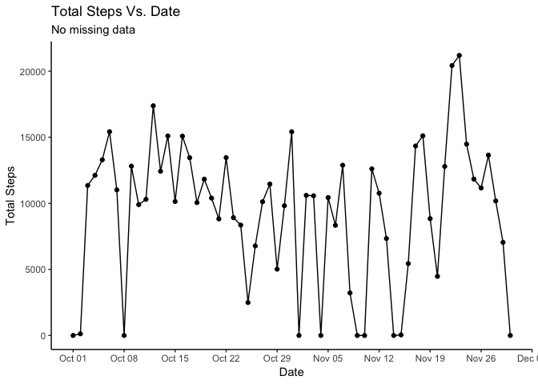

## Loading and preprocessing the data

### The Data

The data was accessed from:  
**URL:** <https://d396qusza40orc.cloudfront.net/repdata%2Fdata%2Factivity.zip>  
**Access Time:** 2018-08-07 20:14:20 BST.  
**Data Format:** ZIP Archive

### Download of, and Extracting the Raw Data

If the data is not downloaded, the data is downloaded from the above URL. If the data has been previously downloaded and named as data.zip, the script prints a message and moves onto the next step.


```r
if (!file.exists("data.zip")) {
     message("Downloading data from 'https://d396qusza40orc.cloudfront.net/repdata%2Fdata%2Factivity.zip'... Please wait")
     download.file(url = "https://d396qusza40orc.cloudfront.net/repdata%2Fdata%2Factivity.zip", destfile = "data.zip", method = "curl")
} else {
     message("Data already downloaded as data.zip")
}
```

If the data is not extracted, the data is extracted from data.zip. If the data has been previously extracted to to "UCI HAR Data set", the script prints a message and moves onto the next step.


```r
if (file.exists("data.zip") & !file.exists("activity.csv")) {
     message("Extracting data to './activity.csv'... Please wait")
     unzip("data.zip")
} else {
     message("Data already extracted to ./activity.csv")
}
```

### Preprocessing the data

The following libraries and versions, were used in the preprocessing and manipulation of the data

| Package    | Version |
|------------|:--------|
| data.table | 1.11.4  |
| dplyr      | 0.7.6   |
| tidyr      | 0.8.1   |
| lubridate  | 1.7.4   |
| ggplot2    | 3.0.0   |

If installed, they can be loaded as follows:


```r
library(data.table)
library(dplyr)
library(tidyr)
library(lubridate)
library(ggplot2)
```

The data was read into a data.frame, `data` using `read.csv()`.


```r
data <- read.csv("activity.csv")
```

The data.frame `data` contained three columns as shown by the `names()` function: "steps"; "date"; and "interval". 


```r
names(data)
```

```
## [1] "steps"    "date"     "interval"
```
The variables included in this data set are:

* `steps`: *\<integer\>* Number of steps taking in a 5-minute interval (missing
    values are coded as `NA`).

* `date`: *\<factor\>* The date on which the measurement was taken in YYYY-MM-DD
    format.

* `interval`: *\<integer\>* Identifier for the 5-minute interval in which
    measurement was taken. Note, values for this variable of 345, 2125 and 0 would correspond to times (in HH:MM format) of 03:45, 21:25 and 00:00 (midnight) respectively.

As mapping trends relating to specific days and/or parts of the week would be of interest, two character vectors were defined to easily map the result of inputting date data into the lubridate function `wday()` to the desired result (i.e. the day of the week or if day of the week is weekday/weekend).


```r
week_day <- c("Sunday","Monday","Tuesday","Wednesday","Thursday","Friday","Saturday")
week_end <- c("weekend","weekday","weekday","weekday","weekday","weekday","weekend")
```

* `week_day`: *\<character\>* Character vector of the days of the week where `week_day[1]` maps to Sunday to be consistent with the output of the lubridate function `wday()`.

* `week_end`: *\<character\>* Character vector based upon the days of the week where `week_end[1]` maps to the result for a Sunday to be consistent with the output of the lubridate function `wday()`. In this variable, Saturday and Sunday are classified as weekend days (`weekend`), while Monday, Tuesday, Wednesday, Thursday and Friday are classified as week days (`weekday`).

In order to be able to calculate statistics based upon day of the week and part of the week the columns `week.day` and `week.end` were added to the original data set, `data` by using the `mutate()` function. The `date` column was converted from *\<factor\>* to *\<date\>* type using the `as.Date` function. A random sample of rows from the mutated data.frame, `data` is also given to demonstrate the effect of the transformation and the current state of the data set.


```r
data <- mutate(data,
     date       = as.Date(date, format = "%Y-%m-%d"),
     week.day   = week_day[wday(date)],
     week.end   = week_end[wday(date)]
     )
data[sample(nrow(data), 10),]
```

```
##       steps       date interval  week.day week.end
## 8263      0 2012-10-29     1630    Monday  weekday
## 16229    67 2012-11-26      820    Monday  weekday
## 635       0 2012-10-03      450 Wednesday  weekday
## 15657   139 2012-11-24      840  Saturday  weekend
## 7659     30 2012-10-27     1410  Saturday  weekend
## 11797    NA 2012-11-10     2300  Saturday  weekend
## 3966     58 2012-10-14     1825    Sunday  weekend
## 3956     55 2012-10-14     1735    Sunday  weekend
## 16868     0 2012-11-28     1335 Wednesday  weekday
## 16518     0 2012-11-27      825   Tuesday  weekday
```

## What is mean total number of steps taken per day?

The total, mean and median steps taken per day, named `steps.total`, `steps.mean` and `steps.median` were calculated and the result placed into a data.frame, `steps_stats`. This was achieved by grouping the data.frame `data` by `date` and piping the output to `summarise()` with the appropriate quantites calculated. A sample of the data.frame `steps_stats` can also be seen.


```r
steps_stats <- data %>%
     group_by(.,date) %>%
     summarise(.,
          steps.total  = sum(steps),
          steps.mean   = mean(steps),
          steps.median = median(steps)
     )

head(steps_stats)
```

```
## # A tibble: 6 x 4
##   date       steps.total steps.mean steps.median
##   <date>           <int>      <dbl>        <dbl>
## 1 2012-10-01          NA     NA               NA
## 2 2012-10-02         126      0.438            0
## 3 2012-10-03       11352     39.4              0
## 4 2012-10-04       12116     42.1              0
## 5 2012-10-05       13294     46.2              0
## 6 2012-10-06       15420     53.5              0
```

A line with point plot of `steps.total` versus `date` was produced using the data.frame, `step_stats` using `ggplot` from the `ggplot2` package. The major x-tics are spaced one week apart. Notible here, are the missing values introduced by the "`NA`" values.


```r
ggplot(steps_stats,
aes(x=date, y=steps.total, group=1)) + geom_line() + geom_point() +
labs(title = "Total Steps Vs. Date", subtitle = "Missing data included", x = "Date", y = "Total Steps") +
scale_x_date(date_breaks = "1 week", date_minor_breaks = "1 day", date_labels = "%b %d") +
theme_classic()
```

<!-- -->

The mean and median total number of steps can be calculated on `steps_stats` using the `mean()` and `median()` functions. The option `na.rm = TRUE` is set as the data for `steps` contains missing values. From the data it can be seen that the mean number of steps per day was 10766.19 steps, with a median value of 10765 steps.


```r
mean(steps_stats$steps.total, na.rm = TRUE)
```

```
## [1] 10766.19
```

```r
median(steps_stats$steps.total, na.rm = TRUE)
```

```
## [1] 10765
```

## What is the average daily activity pattern?

The mean daily pattern is derived in a similar way to the previous section where I calculated the previous data.frame, `day_stats`. The total, mean and median steps taken per interval, named `steps.total`, `steps.mean` and `steps.median` were calculated and the result placed into a data.frame, `day_stats`. This was achieved by grouping the data.frame `data` by `interval` and piping the output to `summarise()` with the appropriate quantites calculated. A sample of the data.frame `day_stats` can also be seen.


```r
day_stats <- data %>%
     group_by(.,interval) %>%
     summarise(.,
          steps.total  = sum(steps, na.rm=TRUE),
          steps.mean   = mean(steps, na.rm=TRUE),
          steps.median = median(steps, na.rm=TRUE)
     )

head(day_stats)
```

```
## # A tibble: 6 x 4
##   interval steps.total steps.mean steps.median
##      <int>       <int>      <dbl>        <int>
## 1        0          91     1.72              0
## 2        5          18     0.340             0
## 3       10           7     0.132             0
## 4       15           8     0.151             0
## 5       20           4     0.0755            0
## 6       25         111     2.09              0
```

A line with point plot of `steps.total` versus `interval` was produced using the data.frame, `day_stats` using `ggplot` from the `ggplot2` package. The major x-tics are spaced apart by 200 (i.e. 2 hours).


```r
ggplot(day_stats,
aes(x=interval, y=steps.total, group=1)) + geom_line() + geom_point() +
labs(title = "Mean Steps Vs. Interval", x = "Interval", y = "Mean Steps") +
scale_x_continuous(limits = c(0,2350), breaks = seq(0,2400,200)) +
theme_classic()
```

<!-- -->

The maximum value can be seen by the spike on the graph above and by ordering `day_stats` asending by `steps.mean` by using the `aarange()` function. The maximum average daily activity occurs durring `interval = 835` which corresponds to the time arround 08:35.


```r
head(day_stats %>% arrange(.,desc(steps.mean)))
```

```
## # A tibble: 6 x 4
##   interval steps.total steps.mean steps.median
##      <int>       <int>      <dbl>        <int>
## 1      835       10927       206.           19
## 2      840       10384       196.           51
## 3      850        9720       183.           16
## 4      845        9517       180.           60
## 5      830        9397       177.           37
## 6      820        9071       171.           45
```

## Imputing missing values

The data has serveral days that are missing which are denoted in the data set as "`NA`". Using a combination of the `sum()` and `is.na()`functions it can be calculated that 2304 entries for `steps` are blank.


```r
sum(is.na(data$steps))
```

```
## [1] 2304
```

In order to fill in the blanks in the data I will consider a value of "`NA`" equal to 0. Therefore, I substitute all the "`NA`" values in the `steps` column of `data` using `replace_na()` from the tidyr package. The output of the mutation of the data.frame was output to a new data.frame, `data_tidy`.


```r
data_tidy <- mutate(data, steps = replace_na(steps,0))
```


```r
steps_stats_tidy <- data_tidy %>%
     group_by(.,date) %>%
     summarise(.,
          steps.total  = sum(steps),
          steps.mean   = mean(steps),
          steps.median = median(steps)
     )

head(steps_stats_tidy)
```

```
## # A tibble: 6 x 4
##   date       steps.total steps.mean steps.median
##   <date>           <dbl>      <dbl>        <dbl>
## 1 2012-10-01           0      0                0
## 2 2012-10-02         126      0.438            0
## 3 2012-10-03       11352     39.4              0
## 4 2012-10-04       12116     42.1              0
## 5 2012-10-05       13294     46.2              0
## 6 2012-10-06       15420     53.5              0
```

A line with point plot of `steps.total` versus `date` was produced using the data.frame, `step_stats` using `ggplot` from the `ggplot2` package. The major x-tics are spaced one week apart. Notible here, are the missing values introduced by the "`NA`" values.


```r
ggplot(steps_stats_tidy,
aes(x=date, y=steps.total, group=1)) + geom_line() + geom_point() +
labs(title = "Total Steps Vs. Date", subtitle = "No missing data", x = "Date", y = "Total Steps") +
scale_x_date(date_breaks = "1 week", date_minor_breaks = "1 day", date_labels = "%b %d") +
theme_classic()
```

<!-- -->

The mean and median total number of steps can be calculated on `steps_stats_tidy` using the `mean()` and `median()` functions. The option `na.rm = TRUE` is not set on this occasion as the data for `steps` no longer contains missing values. From the data it can be seen that the mean number of steps per day was 9354.23 steps, with a median value of 10395 steps.


```r
mean(steps_stats_tidy$steps.total)
```

```
## [1] 9354.23
```

```r
median(steps_stats_tidy$steps.total)
```

```
## [1] 10395
```

Reincluding the missing data as zeros has changed the mean more so that the median value. On the histogram the substitution of "`NA`" values for zeros gives the false appearance that on all those days no step activity was taken by the user of the device. Including the zeros lowers the overall mean of the data as instead of taking the mean over 61 days (17568 records total) rather than the 53 days (15264 records total) where the step activity has truely been recorded. Adding extra zeros into the mean, has the effect of diving the same total number of steps divided by a larger number biasing the input to `mean()` towards zero, leading to a much smaller mean. This large number of zeros being added into the set for the median will decrease the mean by biasing the data placed into `median()` towards smaller values for recorded step activity.

## Are there differences in activity patterns between weekdays and weekends?

Earlier, columns were added to the data.frame, `data` to indicate which day a date belongs to and wether it is a weekday or a weekend. These columns were carried forward into the tidied data.frame, `data_tidy`. These can be used to compare the average actvity of a day based upon wether the day is a weekday or weekend.

The data.frame, `week_stats` contains the sum, mean and median values for steps grouped by wether the date the data was recorded was a weekday or weekend. The data.frame, `week_stats` was ordered by the columns `week.end` and `interval` and passed to summarise to calculate the sum, mean and median steps for each interval and if the day was a weekday/weekend.


```r
week_stats <- data_tidy %>%
     group_by(.,week.end,interval) %>%
     summarise(.,
          steps.total  = sum(steps),
          steps.mean   = mean(steps),
          steps.median = median(steps)
     )
```

A line with point plot of `steps.mean` versus `interval` was produced using the data.frame, `week_stats` using `ggplot` from the `ggplot2` package. The major x-tics are spaced apart by 200 (i.e. 2 hours), and the plot is faceted to compare the mean steps on a weekday versus the weekend.


```r
ggplot(week_stats,
aes(x=interval, y=steps.mean, color = week.end)) + geom_line() + geom_point() +
labs(title = "Mean Steps Vs. Interval", subtitle = "Weekday vs. Weekend", x = "Interval", y = "Mean Steps") +
scale_x_continuous(limits = c(0,2350), breaks = seq(0,2400,200)) +
facet_wrap(~week.end, ncol=1, nrow=2) +
theme_classic() + theme(legend.position="none")
```

<!-- -->

From the plot it can be seen that durring the weekend the user is more consistantly active throughtout the day than durring weekdays. Durring the week there is a major spike at approximately `interval=835` with minor peaks at approximately `interval=1200,1530,1800'. Both plots seem to have comparible periods of inactivity at between intervals 0 and approximately 600.
